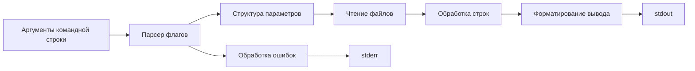

# CLI-утилиты cat и grep на C

Реализация двух утилит командной строки — `cat` и `grep` — с поведением, совместимым с классическими Unix-инструментами. Проект демонстрирует навыки анализа требований, формализации поведения, работы с текстовыми данными, регулярными выражениями, тестирования и документирования.

## О проекте

`cat` и `grep` — базовые инструменты обработки текста в Unix-подобных системах. В рамках проекта реализованы:

- чтение и вывод содержимого файлов;
- нумерация строк, сжатие пустых строк, отображение служебных символов;
- поиск по регулярным выражениям;
- фильтрация, инверсия совпадений, подсчёт строк, вывод имён файлов;
- поддержка комбинаций флагов;
- обработка ошибок и кодов возврата.

Проект полезен не только как демонстрация программирования на C, но и как пример работы с требованиями, граничными случаями и интеграционными проверками.

## Ценность для аналитика

Проект показывает навыки, которые напрямую применимы в аналитике:

- **Анализ требований.** Поведение утилит описано через флаги, режимы работы, форматы вывода и ограничения.
- **Формализация CLI-контрактов.** Для каждой команды определены входные аргументы, опции, допустимые комбинации и реакция на ошибки.
- **Работа с текстовыми форматами.** Обработка строк, разделителей, табов, переводов строк, спецсимволов.
- **Регулярные выражения.** Поиск, фильтрация и извлечение данных по шаблонам.
- **Интеграционное тестирование.** Сравнение поведения с эталонными утилитами `cat` и `grep`.
- **Документирование.** Описание сборки, запуска, поддерживаемых сценариев и ограничений.
- **Понимание интеграций.** Обмен текстовыми данными, парсинг, валидация, обработка ошибок — типовые задачи при проектировании интеграций.

## Возможности

### cat

Поддерживаются:

- `-b`, `--number-nonblank` — нумерация только непустых строк;
- `-e` — отображение конца строки как `$` с учётом `-v`;
- `-E` — отображение конца строки как `$` без `-v`;
- `-n`, `--number` — нумерация всех строк;
- `-s`, `--squeeze-blank` — сжатие нескольких пустых строк;
- `-t` — отображение табов как `^I` с учётом `-v`;
- `-T` — отображение табов как `^I` без `-v`;
- `-v` — отображение непечатаемых символов.

### grep

Поддерживаются:

- `-e` — задание шаблона;
- `-i` — игнорирование регистра;
- `-v` — инвертирование совпадений;
- `-c` — вывод количества совпадающих строк;
- `-l` — вывод только имён совпадающих файлов;
- `-n` — вывод номера строки;
- `-h` — вывод без имени файла;
- `-s` — подавление сообщений об ошибках;
- `-f file` — чтение шаблонов из файла;
- `-o` — вывод только совпавших частей строки;
- комбинации флагов, например `-iv`, `-in`, `-hn`.

## Архитектура



Общие модули вынесены в отдельную директорию, чтобы избежать дублирования кода между утилитами. Логика разделена на:

- разбор аргументов;
- валидацию параметров;
- чтение данных;
- обработку текста;
- вывод результата;
- обработку ошибок.

## Сборка

```bash
make
```

После сборки доступны исполняемые файлы:

```bash
./cat
./grep
```

## Примеры запуска

```bash
./cat -b test.txt
./cat -n -s test.txt
./cat -e -t -v test.txt

./grep -i "apple" test.txt
./grep -n -v "ginger" test.txt
./grep -c "rain" test.txt
./grep -l "apple" test.txt test2.txt
./grep -o -e "a.*e" test.txt
```

## Тестирование

Для проверки поведения используются интеграционные тесты на Bash. Результаты работы сравниваются с эталонными утилитами `cat` и `grep`.

Покрываются:

- одиночные флаги;
- комбинации флагов;
- разные типы входных файлов;
- пустые строки, табы, спецсимволы;
- несуществующие файлы;
- ошибки чтения;
- граничные случаи регулярных выражений.

Пример запуска:

```bash
bash cat_test.sh
bash grep_test.sh
```

## Результаты

- Реализованы `cat` и `grep` с поддержкой ключевых флагов и их комбинаций.
- Поведение проверено сравнением с реальными Unix-утилитами.
- Код структурирован, общие модули переиспользуются.
- Обработаны ошибки и коды возврата.
- Подготовлена документация по сборке и использованию.

